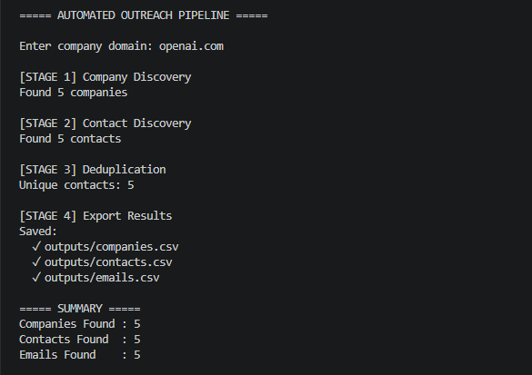
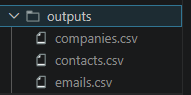

# Automated Outreach Pipeline

## Overview

Automated Outreach Pipeline is a Python-based lead generation and outreach automation system that processes a target company domain, discovers relevant companies and contacts, generates personalized outreach emails, exports prospect data, and delivers emails using the Brevo Email API.

The project demonstrates an end-to-end outreach workflow including prospect discovery, contact management, personalization, data export, and transactional email delivery.

---

## Features

- Company Discovery
- Contact Discovery
- Email Resolution
- Contact Deduplication
- CSV Export
- Personalized Email Generation
- Safety Checkpoint Before Sending
- Logging and Monitoring
- Brevo Email API Integration
- Modular Architecture
- Environment Variable Configuration
- Error Handling

---

## Architecture

```text
Input Domain
      │
      ▼
Company Discovery
      │
      ▼
Contact Discovery
      │
      ▼
Email Resolution
      │
      ▼
Deduplication
      │
      ▼
CSV Export
      │
      ▼
Safety Checkpoint
      │
      ▼
Brevo Email API
      │
      ▼
Email Delivery
```

---

## Project Structure

```text
automated-outreach-pipeline/
│
├── main.py
├── config.py
├── requirements.txt
├── README.md
│
├── services/
│   ├── company_finder.py
│   ├── contact_finder.py
│   ├── email_finder.py
│   ├── mailer.py
│   └── brevo.py
│
├── utils/
│   └── logger.py
│
├── templates/
│   └── outreach.txt
│
├── data/
│   └── companies.csv
│
├── outputs/
│   ├── companies.csv
│   ├── contacts.csv
│   └── emails.csv
│
├── assets/
│   ├── pipeline-run.png
│   ├── contact-preview.png
│   ├── csv-files.png
│   ├── brevo-success.png
│   └── email-received.png
│
└── tests/
    └── test_company_finder.py
```

---

## Technologies Used

- Python
- Pandas
- Requests
- Python Dotenv
- Rich
- Git
- GitHub
- Brevo API

---

## Installation

### Clone Repository

```bash
git clone https://github.com/Girishg0wda/automated-outreach-pipeline.git
cd automated-outreach-pipeline
```

### Create Virtual Environment

```bash
python -m venv env
```

### Activate Environment

Windows:

```bash
env\Scripts\activate
```

### Install Dependencies

```bash
pip install -r requirements.txt
```

---

## Environment Variables

Create a `.env` file in the root directory:

```env
BREVO_API_KEY=your_brevo_api_key
```

---

## Running the Project

```bash
python main.py
```

### Example Input

```text
openai.com
```

---

## Output Files

The pipeline automatically generates:

```text
outputs/companies.csv
outputs/contacts.csv
outputs/emails.csv
```

---

## Screenshots

### Pipeline Execution



### Contact Discovery


### CSV Output Files



### Brevo API Integration


### Email Received


---

## Sample Workflow

1. User enters a company domain.
2. System discovers related companies.
3. Contacts are generated for each company.
4. Email addresses are resolved.
5. Duplicate contacts are removed.
6. Results are exported to CSV files.
7. User confirms outreach.
8. Personalized emails are generated.
9. Emails are delivered through Brevo API.

---

## Future Improvements

- Domain Verification
- Custom Business Email Sender
- Real Company Discovery APIs
- Real Contact Discovery APIs
- Batch Scheduling
- Analytics Dashboard
- Campaign Tracking
- Lead Scoring
- CRM Integration

---

## Testing

Run tests using:

```bash
pytest
```

---

## Author

**Girish R**

GitHub: https://github.com/Girishg0wda

---

## License

This project was created for educational and internship assessment purposes.
